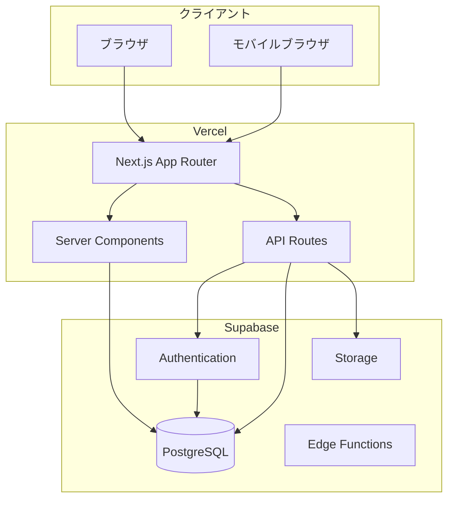

# 技術設計

## 概要

本ドキュメントでは、職人Beautyの技術アーキテクチャ、データモデル、API設計について定義します。

---

## 技術スタック

### フロントエンド

| 技術 | バージョン | 用途 |
|------|-----------|------|
| Next.js | 16.1.6 | Reactフレームワーク（App Router） |
| React | 19.2.3 | UIライブラリ |
| TypeScript | 5.x | 型安全な開発 |
| Tailwind CSS | 4.x | スタイリング |
| React Hook Form | 最新 | フォーム管理 |
| Zod | 最新 | バリデーション |

### バックエンド

| 技術 | 用途 |
|------|------|
| Next.js API Routes | APIエンドポイント |
| Supabase | BaaS（Backend as a Service） |

### Supabase サービス

| サービス | 用途 |
|---------|------|
| Supabase Auth | 認証・認可 |
| Supabase Database | PostgreSQLデータベース |
| Supabase Storage | ファイルストレージ（画像など） |
| Supabase Realtime | リアルタイム通知（将来） |

### インフラ

| サービス | 用途 |
|---------|------|
| Vercel | フロントエンド・APIホスティング |
| Supabase Cloud | データベース・認証・ストレージ |

---

## システム構成図



---

## データモデル

### ER図

```mermaid
erDiagram
    users ||--o| craftsman_profiles : has
    users ||--o{ bookings : "creates as customer"
    craftsman_profiles ||--o{ craftsman_services : offers
    craftsman_profiles ||--o{ availability : sets
    craftsman_profiles ||--o{ bookings : receives
    services ||--o{ craftsman_services : "belongs to"
    bookings ||--o| reviews : has
    bookings }o--|| craftsman_services : "for service"
    
    users {
        uuid id PK
        string email UK
        string encrypted_password
        string role "customer | craftsman | admin"
        string name
        string phone
        string address
        timestamp created_at
        timestamp updated_at
    }
    
    craftsman_profiles {
        uuid id PK
        uuid user_id FK UK
        string display_name
        text description
        string profile_image_url
        string prefecture
        string city
        int service_radius_km
        jsonb qualifications
        int experience_years
        decimal rating_avg
        int review_count
        boolean is_active
        timestamp created_at
        timestamp updated_at
    }
    
    services {
        uuid id PK
        string name
        string category
        text description
        string icon
        int sort_order
        boolean is_active
        timestamp created_at
    }
    
    craftsman_services {
        uuid id PK
        uuid craftsman_id FK
        uuid service_id FK
        int price_min
        int price_max
        int duration_minutes
        text notes
        boolean is_active
        timestamp created_at
    }
    
    availability {
        uuid id PK
        uuid craftsman_id FK
        date date
        time start_time
        time end_time
        boolean is_available
        timestamp created_at
    }
    
    bookings {
        uuid id PK
        uuid customer_id FK
        uuid craftsman_id FK
        uuid craftsman_service_id FK
        date booking_date
        time booking_time
        string status "pending | confirmed | completed | cancelled | rejected"
        text work_address
        text work_description
        text customer_notes
        text craftsman_notes
        timestamp created_at
        timestamp updated_at
    }
    
    reviews {
        uuid id PK
        uuid booking_id FK UK
        uuid customer_id FK
        uuid craftsman_id FK
        int rating "1-5"
        text comment
        timestamp created_at
    }
```

### テーブル詳細

#### users（ユーザー）

| カラム | 型 | 説明 |
|--------|-----|------|
| id | UUID | 主キー |
| email | VARCHAR(255) | メールアドレス（ユニーク） |
| encrypted_password | VARCHAR | 暗号化パスワード |
| role | VARCHAR(20) | 権限（customer/craftsman/admin） |
| name | VARCHAR(100) | 氏名 |
| phone | VARCHAR(20) | 電話番号 |
| address | TEXT | 住所 |
| created_at | TIMESTAMP | 作成日時 |
| updated_at | TIMESTAMP | 更新日時 |

#### craftsman_profiles（職人プロフィール）

| カラム | 型 | 説明 |
|--------|-----|------|
| id | UUID | 主キー |
| user_id | UUID | ユーザーID（FK） |
| display_name | VARCHAR(100) | 表示名 |
| description | TEXT | 自己紹介 |
| profile_image_url | VARCHAR(500) | プロフィール画像URL |
| prefecture | VARCHAR(20) | 都道府県 |
| city | VARCHAR(50) | 市区町村 |
| service_radius_km | INT | 対応可能範囲（km） |
| qualifications | JSONB | 保有資格（配列） |
| experience_years | INT | 経験年数 |
| rating_avg | DECIMAL(2,1) | 平均評価 |
| review_count | INT | レビュー数 |
| is_active | BOOLEAN | 公開状態 |

#### services（サービスマスタ）

| カラム | 型 | 説明 |
|--------|-----|------|
| id | UUID | 主キー |
| name | VARCHAR(100) | サービス名 |
| category | VARCHAR(50) | カテゴリ |
| description | TEXT | 説明 |
| icon | VARCHAR(50) | アイコン名 |
| sort_order | INT | 表示順 |
| is_active | BOOLEAN | 有効フラグ |

#### craftsman_services（職人サービス）

| カラム | 型 | 説明 |
|--------|-----|------|
| id | UUID | 主キー |
| craftsman_id | UUID | 職人ID（FK） |
| service_id | UUID | サービスID（FK） |
| price_min | INT | 最低料金 |
| price_max | INT | 最高料金 |
| duration_minutes | INT | 作業時間（分） |
| notes | TEXT | 備考 |
| is_active | BOOLEAN | 有効フラグ |

#### availability（空き状況）

| カラム | 型 | 説明 |
|--------|-----|------|
| id | UUID | 主キー |
| craftsman_id | UUID | 職人ID（FK） |
| date | DATE | 日付 |
| start_time | TIME | 開始時刻 |
| end_time | TIME | 終了時刻 |
| is_available | BOOLEAN | 予約可能フラグ |

#### bookings（予約）

| カラム | 型 | 説明 |
|--------|-----|------|
| id | UUID | 主キー |
| customer_id | UUID | 発注者ID（FK） |
| craftsman_id | UUID | 職人ID（FK） |
| craftsman_service_id | UUID | 職人サービスID（FK） |
| booking_date | DATE | 予約日 |
| booking_time | TIME | 予約時刻 |
| status | VARCHAR(20) | ステータス |
| work_address | TEXT | 作業場所住所 |
| work_description | TEXT | 作業内容詳細 |
| customer_notes | TEXT | 発注者メモ |
| craftsman_notes | TEXT | 職人メモ |

#### reviews（レビュー）

| カラム | 型 | 説明 |
|--------|-----|------|
| id | UUID | 主キー |
| booking_id | UUID | 予約ID（FK、ユニーク） |
| customer_id | UUID | 発注者ID（FK） |
| craftsman_id | UUID | 職人ID（FK） |
| rating | INT | 評価（1-5） |
| comment | TEXT | コメント |

---

## API設計

### 認証 API

| メソッド | エンドポイント | 説明 |
|---------|---------------|------|
| POST | /api/auth/signup | 会員登録 |
| POST | /api/auth/login | ログイン |
| POST | /api/auth/logout | ログアウト |
| GET | /api/auth/me | 現在のユーザー取得 |

### 職人 API

| メソッド | エンドポイント | 説明 |
|---------|---------------|------|
| GET | /api/craftsmen | 職人一覧取得 |
| GET | /api/craftsmen/:id | 職人詳細取得 |
| GET | /api/craftsmen/:id/services | 職人のサービス一覧 |
| GET | /api/craftsmen/:id/availability | 職人の空き状況 |
| GET | /api/craftsmen/:id/reviews | 職人のレビュー一覧 |

### 職人プロフィール API（認証必須）

| メソッド | エンドポイント | 説明 |
|---------|---------------|------|
| GET | /api/craftsman/profile | 自分のプロフィール取得 |
| PUT | /api/craftsman/profile | プロフィール更新 |
| GET | /api/craftsman/services | 自分のサービス一覧 |
| POST | /api/craftsman/services | サービス追加 |
| PUT | /api/craftsman/services/:id | サービス更新 |
| DELETE | /api/craftsman/services/:id | サービス削除 |
| GET | /api/craftsman/availability | 自分の空き状況 |
| POST | /api/craftsman/availability | 空き状況追加 |
| PUT | /api/craftsman/availability/:id | 空き状況更新 |

### 予約 API

| メソッド | エンドポイント | 説明 |
|---------|---------------|------|
| POST | /api/bookings | 予約リクエスト作成 |
| GET | /api/bookings | 自分の予約一覧 |
| GET | /api/bookings/:id | 予約詳細 |
| PUT | /api/bookings/:id/confirm | 予約承認（職人） |
| PUT | /api/bookings/:id/reject | 予約却下（職人） |
| PUT | /api/bookings/:id/complete | 作業完了（職人） |
| PUT | /api/bookings/:id/cancel | 予約キャンセル |

### レビュー API

| メソッド | エンドポイント | 説明 |
|---------|---------------|------|
| POST | /api/bookings/:id/review | レビュー投稿 |

### サービスマスタ API

| メソッド | エンドポイント | 説明 |
|---------|---------------|------|
| GET | /api/services | サービス一覧取得 |
| GET | /api/services/categories | カテゴリ一覧取得 |

---

## ディレクトリ構成

```
shokunin-beauty/
├── app/                          # Next.js App Router
│   ├── (auth)/                   # 認証関連ページ
│   │   ├── login/
│   │   └── signup/
│   ├── (main)/                   # メインページ
│   │   ├── craftsmen/            # 職人検索・詳細
│   │   │   ├── page.tsx          # 職人一覧
│   │   │   └── [id]/
│   │   │       └── page.tsx      # 職人詳細
│   │   └── bookings/             # 予約管理
│   ├── (craftsman)/              # 職人専用ページ
│   │   ├── dashboard/
│   │   ├── profile/
│   │   ├── services/
│   │   └── availability/
│   ├── api/                      # API Routes
│   │   ├── auth/
│   │   ├── craftsmen/
│   │   ├── craftsman/
│   │   ├── bookings/
│   │   └── services/
│   ├── layout.tsx
│   ├── page.tsx                  # トップページ
│   └── globals.css
├── components/                   # 共通コンポーネント
│   ├── ui/                       # 基本UIコンポーネント
│   ├── forms/                    # フォームコンポーネント
│   └── layouts/                  # レイアウトコンポーネント
├── lib/                          # ユーティリティ
│   ├── supabase/                 # Supabaseクライアント
│   ├── utils/                    # ヘルパー関数
│   └── validations/              # Zodスキーマ
├── types/                        # TypeScript型定義
├── hooks/                        # カスタムフック
├── doc/                          # ドキュメント
├── public/                       # 静的ファイル
└── package.json
```

---

## セキュリティ考慮事項

### 認証・認可

- Supabase Authによる認証
- JWT トークンによるセッション管理
- Row Level Security (RLS) によるデータアクセス制御

### RLSポリシー例

```sql
-- 職人プロフィールは誰でも閲覧可能
CREATE POLICY "craftsman_profiles_select" ON craftsman_profiles
  FOR SELECT USING (is_active = true);

-- 職人プロフィールは本人のみ更新可能
CREATE POLICY "craftsman_profiles_update" ON craftsman_profiles
  FOR UPDATE USING (auth.uid() = user_id);

-- 予約は関係者のみ閲覧可能
CREATE POLICY "bookings_select" ON bookings
  FOR SELECT USING (
    auth.uid() = customer_id OR 
    auth.uid() = (SELECT user_id FROM craftsman_profiles WHERE id = craftsman_id)
  );
```

### 入力バリデーション

- クライアント側: Zod + React Hook Form
- サーバー側: Zodによる再検証
- SQLインジェクション: Supabaseクエリビルダー使用

---

## 追加予定ライブラリ

| ライブラリ | 用途 |
|-----------|------|
| @supabase/supabase-js | Supabaseクライアント |
| @supabase/auth-helpers-nextjs | Next.js認証ヘルパー |
| react-hook-form | フォーム管理 |
| zod | バリデーション |
| @hookform/resolvers | RHF + Zod連携 |
| date-fns | 日付処理 |
| lucide-react | アイコン |
