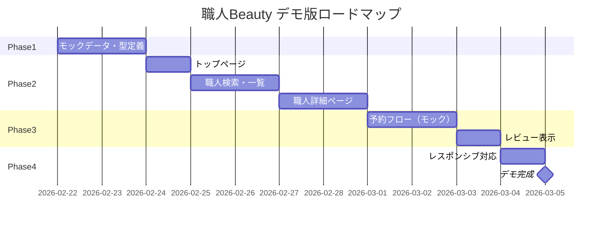

# 開発ロードマップ（デモ版）

## 概要

本プロジェクトは**デモ・プロトタイプ版**として開発します。
「職人Beauty」のコンセプトと主要機能を視覚的に体験できるデモサイトを構築します。

### デモ版の方針

- **永続データベースなし** - モックデータで表示
- **簡易認証** - アカウント名のみでログイン可能（デモ用）
- **Supabase不使用** - 外部サービス依存なし
- **静的データ** - JSONまたはハードコードでモックデータを管理

---

## 技術スタック（デモ版）

| 技術 | 用途 |
|------|------|
| Next.js 16 (App Router) | フレームワーク |
| React 19 | UIライブラリ |
| TypeScript | 型安全な開発 |
| Tailwind CSS 4 | スタイリング |
| Lucide React | アイコン |
| MockAPI.io | モックデータAPI |
| Zustand | 状態管理（認証状態） |

**使用しないもの:**
- Supabase（認証・DB）
- 決済システム

---

## フェーズ概要



---

## Phase 1: モックデータ・基盤整備

### 目標
- モックデータの定義
- 型定義の整備
- 基本UIコンポーネントの確認

### 成果物

| タスク | 詳細 |
|--------|------|
| モックデータ作成 | 職人、サービス、レビューのサンプルデータ |
| 型定義 | TypeScript型（DB不要版） |
| データ取得関数 | モックデータを返すユーティリティ |

### データ構造

```typescript
// lib/mock-data.ts に配置
- craftsmen: 職人一覧（5〜10名分）
- services: サービスマスタ
- reviews: レビューデータ
- availability: 空き状況（固定）
```

### 完了条件
- [x] モックデータが定義されている
- [x] 型定義が整備されている
- [x] データ取得関数が動作する

---

## Phase 2: 主要画面の実装

### 目標
- ユーザーが体験できる主要画面の実装

### 2.1 トップページ

| 要素 | 内容 |
|------|------|
| ヒーローセクション | キャッチコピー、検索導線 |
| サービスカテゴリ | エアコン、水回り、電気、内装 |
| ご利用の流れ | 4ステップの説明 |
| 注目の職人 | モックデータから表示 |

### 2.2 職人検索・一覧

| 要素 | 内容 |
|------|------|
| 検索フォーム | エリア、サービスの選択（フィルタリング動作） |
| 職人カード一覧 | モックデータを表示 |
| ソート | 評価順、料金順（クライアントサイド） |

### 2.3 職人詳細ページ

| 要素 | 内容 |
|------|------|
| プロフィール | 名前、写真、自己紹介、資格 |
| サービス・料金表 | 対応サービスと料金 |
| 空きカレンダー | 固定の空き状況を表示 |
| レビュー一覧 | モックレビューを表示 |
| 予約ボタン | 予約フォームへ遷移 |

### 完了条件
- [x] トップページが表示される
- [x] 職人一覧が検索・フィルタリングできる
- [x] 職人詳細ページが表示される

---

## Phase 3: 予約フロー（モック）

### 目標
- 予約の流れをデモとして体験できる

### 3.1 予約フォーム

| 要素 | 内容 |
|------|------|
| 日時選択 | カレンダーUI（実際の予約は行わない） |
| 作業場所入力 | フォーム表示のみ |
| 確認画面 | 入力内容の表示 |
| 完了画面 | 「予約リクエストを送信しました」メッセージ |

**注意:** 実際のデータ保存は行わない。フォーム送信後は完了画面を表示するのみ。

### 3.2 レビュー表示

| 要素 | 内容 |
|------|------|
| レビュー一覧 | 職人詳細ページにモックレビューを表示 |
| 星評価 | 平均評価の表示 |

### 完了条件
- [x] 予約フォームが表示・入力できる
- [x] 予約完了画面が表示される
- [x] レビューが表示される

---

## Phase 4: 仕上げ

### 目標
- レスポンシブ対応
- 全体の動作確認

### 成果物

| タスク | 詳細 |
|--------|------|
| レスポンシブ対応 | モバイル表示の調整 |
| 動作確認 | 全画面の遷移確認 |
| デモ説明 | 「これはデモです」の表示 |

### 完了条件
- [ ] モバイルで快適に閲覧できる
- [ ] 全画面が正常に表示される
- [ ] デモであることが明示されている

---

## 画面一覧（デモ版）

| パス | 画面名 | 内容 |
|------|--------|------|
| `/` | トップページ | サービス紹介、検索導線 |
| `/craftsmen` | 職人検索 | 一覧表示、フィルタリング |
| `/craftsmen/[id]` | 職人詳細 | プロフィール、サービス、レビュー |
| `/craftsmen/[id]/book` | 予約フォーム | 日時・場所入力 |
| `/craftsmen/[id]/book/complete` | 予約完了 | 完了メッセージ |

**追加実装済み画面（デモ用簡易版）:**
- `/login` - ログイン（アカウント名のみ）
- `/signup` - 会員登録（依頼者/職人選択）
- `/mypage` - マイページ
- `/craftsman/dashboard` - 職人ダッシュボード

**実装しない画面:**
- 実際の予約管理
- 決済画面

---

## ディレクトリ構成（デモ版）

```
app/
├── page.tsx                    # トップページ
├── layout.tsx                  # ルートレイアウト
├── globals.css
├── login/
│   └── page.tsx                # ログイン
├── signup/
│   └── page.tsx                # 会員登録
├── mypage/
│   └── page.tsx                # マイページ
├── craftsman/
│   └── dashboard/
│       └── page.tsx            # 職人ダッシュボード
└── craftsmen/
    ├── page.tsx                # 職人検索・一覧
    └── [id]/
        ├── page.tsx            # 職人詳細
        └── book/
            ├── page.tsx        # 予約フォーム
            └── complete/
                └── page.tsx    # 予約完了

components/
├── ui/                         # 基本UIコンポーネント
└── layouts/                    # レイアウト

lib/
├── api.ts                      # MockAPI クライアント
├── auth.ts                     # 認証状態管理（Zustand）
├── types.ts                    # 型定義
└── utils.ts                    # ユーティリティ
```

---

## 不要になったファイル

以下は本番版用のため、デモ版では不要（削除済み）：

- `lib/supabase/` - Supabaseクライアント
- `lib/validations/` - サーバーサイドバリデーション
- `supabase/` - マイグレーション
- `middleware.ts` - 認証ミドルウェア

---

## デモ版の制限事項

| 機能 | デモ版での扱い |
|------|---------------|
| ユーザー登録 | アカウント名のみで登録可能（デモ用簡易版） |
| ログイン | アカウント名のみでログイン可能（認証なし） |
| 予約送信 | フォーム表示のみ、データ保存なし |
| レビュー投稿 | なし（表示のみ） |
| 職人登録 | なし |
| 決済 | なし |
