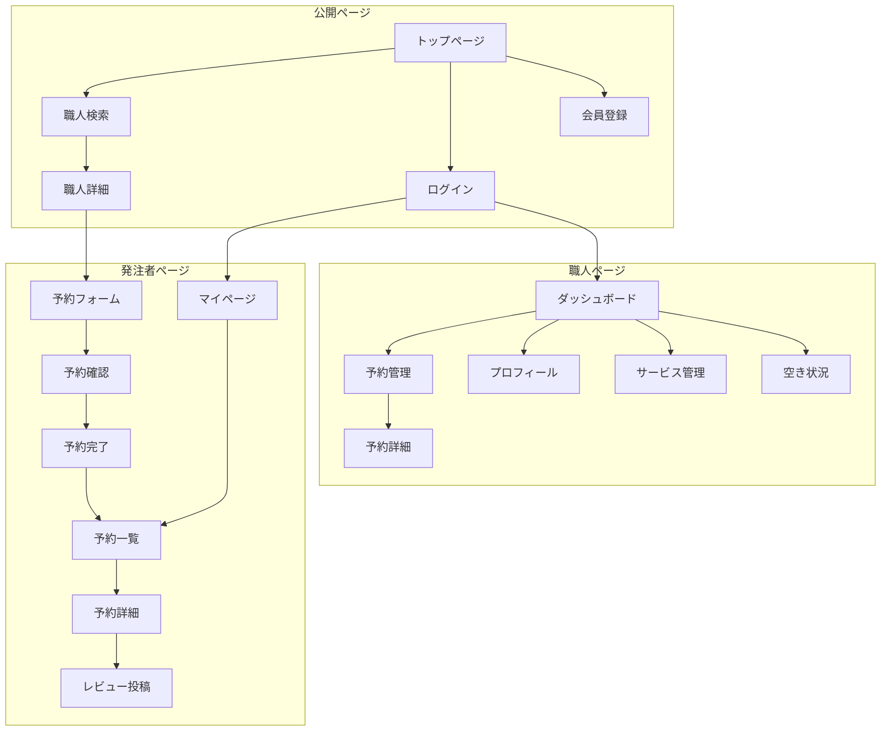
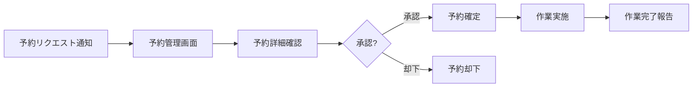

# 画面設計

## 概要

本ドキュメントでは、職人Beautyの画面一覧、主要画面の構成、画面遷移フローを定義します。

---

## 画面一覧

### 共通画面

| ID | 画面名 | パス | 説明 |
|----|--------|------|------|
| C-01 | トップページ | / | サービス紹介、検索導線 |
| C-02 | ログイン | /login | ログインフォーム |
| C-03 | 会員登録 | /signup | 会員登録フォーム |
| C-04 | 会員登録（発注者） | /signup/customer | 発注者向け登録 |
| C-05 | 会員登録（職人） | /signup/craftsman | 職人向け登録 |

### 発注者向け画面

| ID | 画面名 | パス | 説明 |
|----|--------|------|------|
| U-01 | 職人検索 | /craftsmen | 職人検索・一覧 |
| U-02 | 職人詳細 | /craftsmen/[id] | 職人プロフィール・サービス・レビュー |
| U-03 | 予約フォーム | /craftsmen/[id]/book | 予約リクエスト入力 |
| U-04 | 予約確認 | /craftsmen/[id]/book/confirm | 予約内容確認 |
| U-05 | 予約完了 | /bookings/[id]/complete | 予約リクエスト完了 |
| U-06 | マイページ | /mypage | 発注者ダッシュボード |
| U-07 | 予約一覧 | /mypage/bookings | 予約履歴・ステータス確認 |
| U-08 | 予約詳細 | /mypage/bookings/[id] | 予約詳細・キャンセル |
| U-09 | レビュー投稿 | /mypage/bookings/[id]/review | レビュー・評価入力 |
| U-10 | プロフィール編集 | /mypage/profile | 発注者情報編集 |

### 職人向け画面

| ID | 画面名 | パス | 説明 |
|----|--------|------|------|
| W-01 | ダッシュボード | /craftsman | 職人ホーム |
| W-02 | 予約管理 | /craftsman/bookings | 予約リクエスト一覧 |
| W-03 | 予約詳細 | /craftsman/bookings/[id] | 予約詳細・承認/却下 |
| W-04 | プロフィール編集 | /craftsman/profile | 自己紹介・資格等編集 |
| W-05 | サービス管理 | /craftsman/services | サービス・料金設定 |
| W-06 | 空き状況管理 | /craftsman/availability | カレンダー設定 |
| W-07 | レビュー一覧 | /craftsman/reviews | 受けたレビュー確認 |

---

## 画面遷移フロー

### 全体フロー



### 予約フロー（発注者）


### 予約承認フロー（職人）



---

## 主要画面設計

### C-01: トップページ

**目的**: サービス紹介、検索への導線

**構成要素**:
```
┌─────────────────────────────────────────┐
│ ヘッダー（ロゴ、ログイン/会員登録）      │
├─────────────────────────────────────────┤
│                                         │
│  キャッチコピー                         │
│  「信頼できる職人に、簡単に依頼」       │
│                                         │
│  ┌─────────────────────────────────┐   │
│  │ 検索ボックス                     │   │
│  │ [エリア ▼] [サービス ▼] [検索]  │   │
│  └─────────────────────────────────┘   │
│                                         │
├─────────────────────────────────────────┤
│  人気のサービス                         │
│  ┌────┐ ┌────┐ ┌────┐ ┌────┐         │
│  │エア│ │水回│ │電気│ │リフ│         │
│  │コン│ │り  │ │工事│ │ォー│         │
│  └────┘ └────┘ └────┘ └────┘         │
├─────────────────────────────────────────┤
│  サービスの使い方                       │
│  1.検索 → 2.予約 → 3.作業 → 4.レビュー │
├─────────────────────────────────────────┤
│  注目の職人                             │
│  ┌──────────┐ ┌──────────┐            │
│  │ 職人カード│ │ 職人カード│            │
│  └──────────┘ └──────────┘            │
├─────────────────────────────────────────┤
│ フッター                                │
└─────────────────────────────────────────┘
```

### U-01: 職人検索

**目的**: 条件を指定して職人を検索・一覧表示

**構成要素**:
```
┌─────────────────────────────────────────┐
│ ヘッダー                                │
├─────────────────────────────────────────┤
│ パンくず: トップ > 職人検索             │
├──────────┬──────────────────────────────┤
│          │                              │
│ 絞り込み │  検索結果: XX件              │
│          │  ┌─────────────────────────┐ │
│ エリア   │  │ [並び替え: 評価順 ▼]    │ │
│ [▼選択] │  └─────────────────────────┘ │
│          │                              │
│ サービス │  ┌───────────────────────┐   │
│ □エアコン│  │ 職人カード            │   │
│ □水回り │  │ ┌────┐               │   │
│ □電気  │  │ │写真│ 山田工務店    │   │
│          │  │ └────┘ ★4.8 (32件)  │   │
│ 日時     │  │ エアコン取付 ¥8,000〜 │   │
│ [カレンダ│  │ 東京都渋谷区          │   │
│  ー選択] │  └───────────────────────┘   │
│          │                              │
│ 評価     │  ┌───────────────────────┐   │
│ ★4以上  │  │ 職人カード            │   │
│          │  └───────────────────────┘   │
│ [検索]   │                              │
│          │  [もっと見る]                │
└──────────┴──────────────────────────────┘
```

### U-02: 職人詳細

**目的**: 職人の詳細情報確認、予約への導線

**構成要素**:
```
┌─────────────────────────────────────────┐
│ ヘッダー                                │
├─────────────────────────────────────────┤
│ パンくず: トップ > 職人検索 > 詳細      │
├─────────────────────────────────────────┤
│                                         │
│ ┌────────┐  山田工務店                 │
│ │        │  ★4.8 (32件のレビュー)     │
│ │ プロフ │  東京都渋谷区・世田谷区対応 │
│ │ 画像   │  経験15年                   │
│ │        │                             │
│ └────────┘  [予約する]                 │
│                                         │
├─────────────────────────────────────────┤
│ [自己紹介] [サービス] [空き状況] [レビュー]│
├─────────────────────────────────────────┤
│                                         │
│ 自己紹介                                │
│ ─────────                              │
│ 15年の経験を持つエアコン専門の職人です。│
│ 丁寧な作業を心がけています...           │
│                                         │
│ 保有資格                                │
│ ・第二種電気工事士                      │
│ ・冷媒フロン類取扱技術者                │
│                                         │
├─────────────────────────────────────────┤
│ サービス・料金                          │
│ ─────────────                          │
│ ┌─────────────────────────────────┐    │
│ │ エアコン取り付け（標準）        │    │
│ │ ¥8,000〜¥12,000 / 約60分       │    │
│ │ [予約する]                      │    │
│ └─────────────────────────────────┘    │
│ ┌─────────────────────────────────┐    │
│ │ エアコン取り外し                │    │
│ │ ¥5,000〜¥8,000 / 約30分        │    │
│ │ [予約する]                      │    │
│ └─────────────────────────────────┘    │
│                                         │
├─────────────────────────────────────────┤
│ 空き状況                                │
│ ─────────                              │
│ ┌─────────────────────────────────┐    │
│ │       2月                       │    │
│ │ 日 月 火 水 木 金 土            │    │
│ │        1  2  3  4  5            │    │
│ │  6  7 [8] 9 10 11 12            │    │
│ │ 13 14 15 ...                    │    │
│ │                                 │    │
│ │ ○空きあり ×予約済み            │    │
│ └─────────────────────────────────┘    │
│                                         │
├─────────────────────────────────────────┤
│ レビュー                                │
│ ─────────                              │
│ ┌─────────────────────────────────┐    │
│ │ ★★★★★ 5.0                    │    │
│ │ 田中さん 2026/02/15             │    │
│ │ とても丁寧に作業していただき... │    │
│ └─────────────────────────────────┘    │
│ [もっと見る]                            │
│                                         │
└─────────────────────────────────────────┘
```

### U-03: 予約フォーム

**目的**: 予約リクエストの入力

**構成要素**:
```
┌─────────────────────────────────────────┐
│ ヘッダー                                │
├─────────────────────────────────────────┤
│ パンくず: ... > 山田工務店 > 予約       │
├─────────────────────────────────────────┤
│                                         │
│ 予約内容の入力                          │
│ ═════════════                          │
│                                         │
│ 依頼先                                  │
│ ┌─────────────────────────────────┐    │
│ │ 山田工務店                      │    │
│ │ エアコン取り付け（標準）        │    │
│ │ ¥8,000〜¥12,000                │    │
│ └─────────────────────────────────┘    │
│                                         │
│ 予約日時 *                              │
│ ┌─────────────────────────────────┐    │
│ │ [2月] [10日] [10:00 ▼]         │    │
│ └─────────────────────────────────┘    │
│                                         │
│ 作業場所 *                              │
│ ┌─────────────────────────────────┐    │
│ │ 郵便番号: [    -    ]           │    │
│ │ 住所:                           │    │
│ │ [                             ] │    │
│ │ 建物名・部屋番号:               │    │
│ │ [                             ] │    │
│ └─────────────────────────────────┘    │
│                                         │
│ 作業内容の詳細                          │
│ ┌─────────────────────────────────┐    │
│ │ エアコンの機種、設置場所など    │    │
│ │ 詳しく記入してください          │    │
│ │                                 │    │
│ │                                 │    │
│ └─────────────────────────────────┘    │
│                                         │
│ 連絡先電話番号 *                        │
│ [                ]                      │
│                                         │
│          [確認画面へ]                   │
│                                         │
└─────────────────────────────────────────┘
```

### W-01: 職人ダッシュボード

**目的**: 職人のホーム画面、各種情報へのアクセス

**構成要素**:
```
┌─────────────────────────────────────────┐
│ ヘッダー（ロゴ、通知、アカウント）      │
├──────────┬──────────────────────────────┤
│          │                              │
│ サイド   │  こんにちは、山田さん        │
│ メニュー │                              │
│          │  ┌──────────────────────────┐│
│ ダッシュ │  │ 新しい予約リクエスト: 3件││
│ ボード   │  │ [確認する]               ││
│          │  └──────────────────────────┘│
│ 予約管理 │                              │
│          │  今日の予約                  │
│ プロフ   │  ───────────                │
│ ィール   │  ┌──────────────────────────┐│
│          │  │ 10:00 田中様            ││
│ サービス │  │ エアコン取り付け        ││
│ 管理     │  │ 渋谷区神南1-2-3         ││
│          │  └──────────────────────────┘│
│ 空き状況 │                              │
│          │  今月の実績                  │
│ レビュー │  ───────────                │
│          │  予約件数: 12件              │
│ ログアウト│  完了件数: 10件              │
│          │  評価平均: ★4.8              │
│          │                              │
└──────────┴──────────────────────────────┘
```

### W-03: 予約詳細（職人）

**目的**: 予約リクエストの確認、承認/却下

**構成要素**:
```
┌─────────────────────────────────────────┐
│ ヘッダー                                │
├──────────┬──────────────────────────────┤
│          │                              │
│ サイド   │ 予約詳細                     │
│ メニュー │ ═════════                   │
│          │                              │
│          │ ステータス: [リクエスト中]   │
│          │                              │
│          │ 発注者情報                   │
│          │ ───────────                 │
│          │ 氏名: 田中太郎               │
│          │ 電話: 090-XXXX-XXXX          │
│          │                              │
│          │ 予約内容                     │
│          │ ───────────                 │
│          │ サービス: エアコン取り付け   │
│          │ 日時: 2026/02/10 10:00       │
│          │ 料金目安: ¥8,000〜¥12,000   │
│          │                              │
│          │ 作業場所                     │
│          │ ───────────                 │
│          │ 〒150-0001                   │
│          │ 東京都渋谷区神南1-2-3        │
│          │ ABCマンション 101号室        │
│          │ [地図を見る]                 │
│          │                              │
│          │ 作業詳細                     │
│          │ ───────────                 │
│          │ 6畳の部屋にエアコンを設置    │
│          │ 希望です。配管は...          │
│          │                              │
│          │ ┌────────┐ ┌────────┐      │
│          │ │ 承認する │ │ 却下する │      │
│          │ └────────┘ └────────┘      │
│          │                              │
└──────────┴──────────────────────────────┘
```

---

## レスポンシブ対応

### ブレークポイント

| サイズ | 幅 | 対象 |
|--------|-----|------|
| sm | 640px〜 | スマートフォン横 |
| md | 768px〜 | タブレット |
| lg | 1024px〜 | デスクトップ |
| xl | 1280px〜 | 大画面 |

### モバイル対応方針

- **ナビゲーション**: ハンバーガーメニュー
- **検索**: 絞り込みはモーダル表示
- **職人カード**: 1列表示
- **フォーム**: フルワイド入力欄
- **サイドメニュー**: 下部タブナビゲーション（職人画面）

---

## UIコンポーネント一覧

### 基本コンポーネント

| コンポーネント | 説明 |
|---------------|------|
| Button | ボタン（primary, secondary, outline） |
| Input | テキスト入力 |
| Select | セレクトボックス |
| Textarea | 複数行テキスト |
| Checkbox | チェックボックス |
| Radio | ラジオボタン |
| Card | カード |
| Badge | バッジ・タグ |
| Avatar | アバター画像 |
| Rating | 星評価表示 |

### レイアウトコンポーネント

| コンポーネント | 説明 |
|---------------|------|
| Header | 共通ヘッダー |
| Footer | 共通フッター |
| Sidebar | サイドメニュー |
| Container | コンテンツ幅制限 |
| Grid | グリッドレイアウト |

### 機能コンポーネント

| コンポーネント | 説明 |
|---------------|------|
| SearchBox | 検索ボックス |
| CraftsmanCard | 職人カード |
| ServiceCard | サービスカード |
| BookingCard | 予約カード |
| ReviewCard | レビューカード |
| Calendar | カレンダー |
| Pagination | ページネーション |
| Modal | モーダル |
| Toast | トースト通知 |
